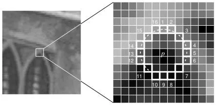
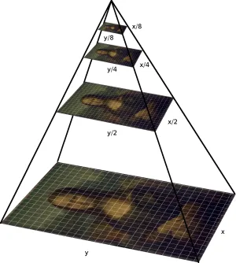
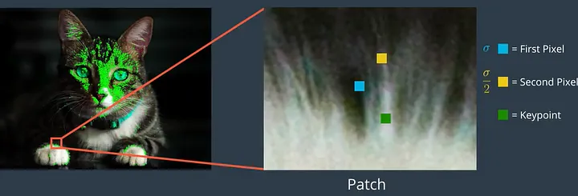

# orb_feature_extraction

### Overview
ORB (Oriented FAST and Rotated BRIEF) is a feature detection and description algorithm developed by OpenCV labs in 2011. It serves as an efficient and cost-effective alternative to SIFT and SURF. This algorithm combines the strengths of the FAST keypoint detector and the BRIEF descriptor, providing good performance in keypoint extraction and representation.

### FAST (Features from Accelerated and Segments Test)
The FAST algorithm identifies keypoints by comparing the brightness of a pixel to its surrounding 16 pixels in a small circular region. If a sufficient number of pixels in the circle are either brighter or darker than the central pixel, it is considered a keypoint. FAST is particularly useful for detecting edges in an image.

However, FAST features lack an orientation component and multiscale features. To address this, ORB employs a multiscale image pyramid, representing the image at different resolutions. This enables ORB to achieve partial scale invariance.

After detecting keypoints at various scales, ORB assigns an orientation to each keypoint based on the intensity changes around it. Intensity centroids are used to determine the orientation, assuming that a corner's intensity is offset from its center.

### BRIEF (Binary Robust Independent Elementary Feature)
BRIEF converts the keypoints identified by FAST into binary feature vectors, representing objects efficiently. Each keypoint is described by a binary feature vector of 128 to 512 bits. BRIEF starts by smoothing the image with a Gaussian Kernel to prevent sensitivity to high-frequency noise.

Pairs of pixels are randomly selected in a defined neighborhood around each keypoint, and their values are compared. If the first pixel is brighter than the second, a value of 1 is assigned; otherwise, 0 is assigned. This process is repeated to create a binary feature vector for each keypoint.

To address rotation invariance, ORB uses rBRIEF (rotation-aware BRIEF). This modification maintains the speed of BRIEF while adding rotation awareness to the descriptor.

